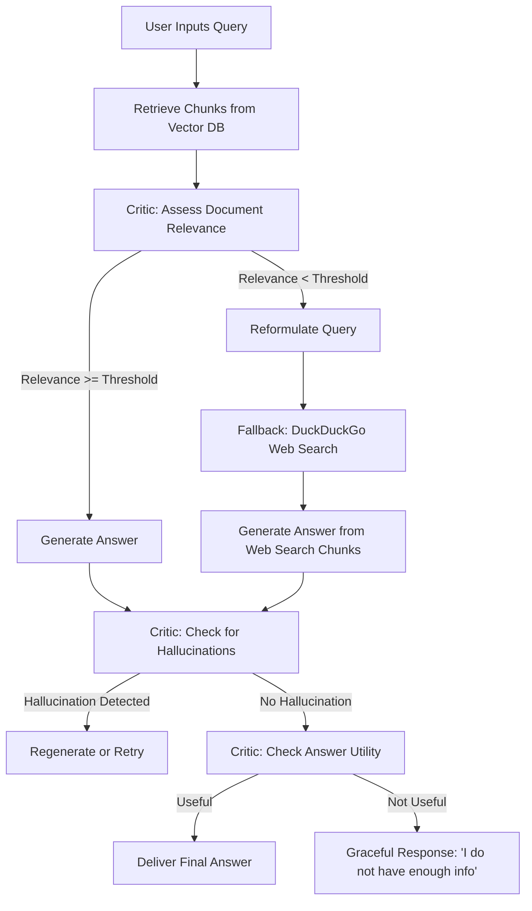

# Epic: Project Overview - Self-Corrective RAG System

## 1. Executive Summary & Vision
Traditional Retrieval-Augmented Generation (RAG) systems operate in a simple, linear fashion: **Retrieve $\rightarrow$ Generate**. While effective for straightforward tasks, this approach is highly prone to two critical failures:
1.  **Retrieval Failure**: If the database doesn't contain relevant information, the system either generates a hallucination or synthesizes an answer using irrelevant context.
2.  **Generation Failure**: Even with correct context, the LLM might hallucinate facts or fail to directly address the user's question.

This project is a **Self-Corrective RAG System** designed to solve these failures through an **agentic, stateful loop**. Instead of just generating an answer, it acts as a critic of its own work: it grades retrieved documents, rewrites queries for web search fallback when database search fails, and critiques its own generated output to ensure zero hallucinations.

Furthermore, this system is optimized for **maximum cost-efficiency** as a personal project, utilizing completely free tiers and highly-performant local-first open-source libraries.

---

## 2. System Objectives & Design Principles

*   **Stateful Agentic Control**: Model the entire system as a directed, cyclic graph using **LangGraph**, enabling loop backs, query reformulations, and multi-step reasoning.
*   **Self-Critique & Corrective Logic**: Integrate an evaluation loop that explicitly verifies document relevance, checks for hallucinations, and validates query-answer utility.
*   **Cost-Efficient & Open-Source First**:
    *   **LLM & Embeddings**: Google Gemini API via AI Studio (100% free within generous rate limits).
    *   **Vector DB**: ChromaDB running locally in-memory/on-disk (0 cost, no cloud subscription).
    *   **Search Fallback**: DuckDuckGo Search API (fully free, no API keys).
*   **No Placeholders / Robust Engineering**: Clean, modular code, comprehensive logging, and well-designed prompts that prevent agent failure loops.

---

## 3. Core Workflow

---

## 4. Key Components

### 1. Ingestion Pipeline
*   Accepts PDFs, text files, or markdown documents.
*   Chunks documents using recursive character text splitting.
*   Generates semantic embeddings using Google's `text-embedding-004` model.
*   Persists embeddings and original text chunks in a local **ChromaDB** database.

### 2. Retrieval & Grading Agent (Critique)
*   Queries the vector store for semantic matches.
*   Uses a specialized LLM grader prompt to determine if each retrieved chunk is relevant to the user query.
*   Filters out noise and irrelevant chunks to prevent context pollution.

### 3. Fallback Web Search Trigger
*   If the retrieval grader determines that the vector store lacks sufficient information, the system triggers a web search.
*   A query reformulation model rewrites the user's question into an optimized web-search query.
*   DuckDuckGo search runs programmatically, retrieving fresh, high-quality search results.

### 4. Answer Synthesis & Hallucination Critique
*   Generates candidate answers using `gemini-1.5-flash`.
*   A **hallucination grader** checks: *"Is the generated answer grounded in the retrieved facts?"*
*   An **answer-utility grader** checks: *"Does the generated answer actually answer the user's question?"*
*   If the answer fails grading, the graph can route the execution to reformulate search queries or output a polite, graceful refusal instead of inventing fake answers.
